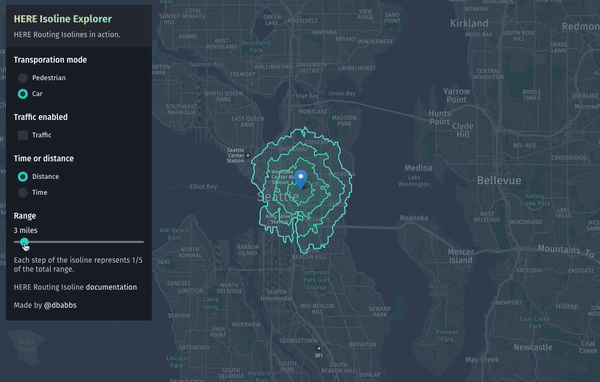

# Isoline demo

__[View live demo](https://dbabbs.github.io/isolines)__

Example application of the HERE Routing API Isoline feature.

## How was this made?
- [HERE Map Tile API](https://developer.here.com/documentation/map-tile/topics/quick-start-map-tile.html) for the map tiles
- [react-leaflet](https://react-leaflet.js.org), an abstraction of the popular [Leaflet](https://leafletjs.com) library, for the map display and control
- [HERE Routing API](https://developer.here.com/api-explorer/rest/routing/distance-based-isoline-start-as-center) for the isolines
